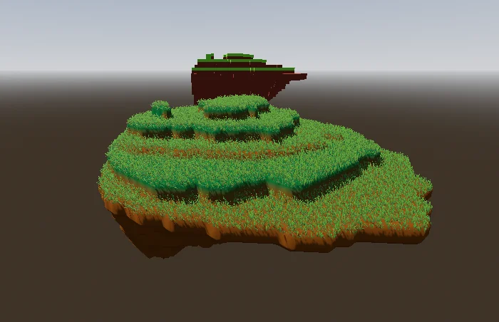
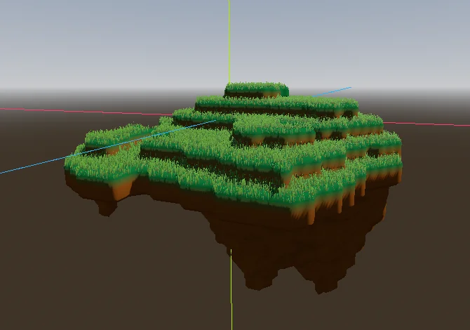
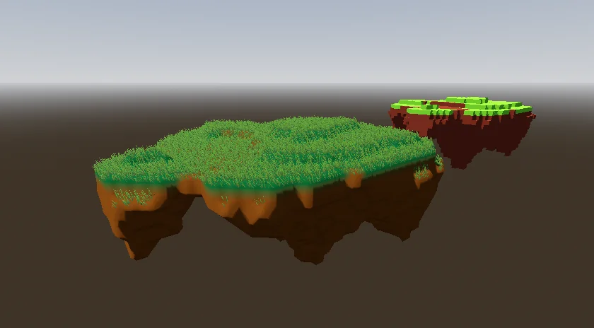

# Flylands
An extensible generator for floating island in the Godot game engine, written in C#.

Compatible with Godot 4.x (Mono Version).

https://github.com/user-attachments/assets/7de2e212-56d0-4753-9237-918d7f49d700

## How To Use:
* Open IslandGenerator.tscn in the editor
* Configure your parameters in the BaseGenerator node
* Click the "Generate" tick-box in the IslandGenerator (root) node
* Configure save path and file name in the insepctor
* Click the "Save" tick-box to export the island (mesh + voxel data) as .tscn
* Use the scenes in your game.

Alternatively: Instantiate and interface the IslandGenerator.tscn in code to generate islands at runtime.

## What To Expect

## Consulted Resources:
* How to shape proper islands into heightmaps: https://www.redblobgames.com/maps/terrain-from-noise/
* How I texture the island based on the voxel data: https://outpostengineer.com/barycentricShader.html
* Grass is basically taken from https://github.com/lonegamedev/godot_botw_grass
